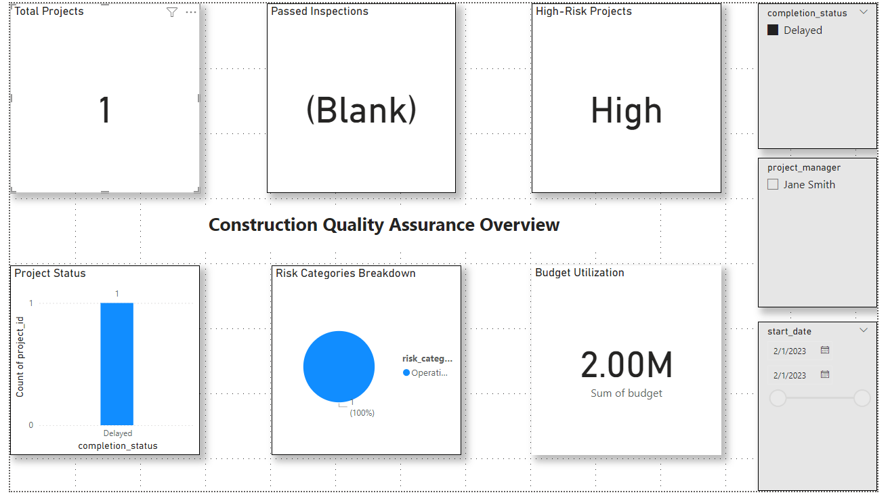

# Construction Quality Assurance Dashboard with Risk Prediction and Automation

## Overview

This project demonstrates a comprehensive approach to **Construction Quality Assurance** by using **Power BI** for data visualization, a **Machine Learning model** to predict project risks, and **automated workflows** to streamline monthly closing procedures. The project leverages a **PostgreSQL** database for data management and **Python** for predictive analytics and process automation.

---

## Features

### 1. **Power BI Dashboard**
   - **Project Overview**: Displays KPIs such as total number of projects, budget utilization, project completion status, and more.
   - **Quality Metrics**: Tracks defects found during inspections, passed inspections over time, and project risk levels.
   - **Risk Analysis**: Visualizes project risk categories (Financial, Operational, Compliance) and highlights high-risk projects.
   

### 2. **Machine Learning Risk Prediction (Python)**
   - **Model**: A machine learning model is built using historical project data to predict the risk level of future projects.
   - **Data**: Historical data on project budgets, quality metrics, and previous risk levels is used to train a **Random Forest Classifier**.
   - **Prediction**: The model predicts whether a new project will have **low**, **medium**, or **high** risk based on features like defects found, budget adherence, and completion status.

### 3. **Automated Monthly Closing Procedures (Python)**
   - **Data Update**: Automates the process of updating monthly financial and operational data in PostgreSQL.
   - **Report Generation**: Automatically generates monthly reports and saves them in CSV format.
   - **Task Scheduling**: Automates the script execution using **Task Scheduler** (Windows) or **cron jobs** (Linux/macOS).

---

## Technologies Used

### 1. **Backend (Database and Data Processing)**
   - **PostgreSQL**: Relational database used to store and manage construction project data.
   - **Python**: Used for machine learning, data analysis, and process automation.

### 2. **Data Visualization**
   - **Power BI**: For creating interactive dashboards and visualizing key metrics.

### 3. **Automation**
   - **Power Automate (Optional)**: To streamline data updates and report generation workflows.
   - **Task Scheduler/Cron Jobs**: For automating Python scripts that update data and generate reports on a schedule.

---

## Installation

### 1. Clone the Repository

```bash
git clone https://github.com/junelus/Construction-Quality-Assurance-Dashboard.git
cd Construction-Quality-Assurance-Dashboard
```
#### Create a virtual environment
```bash
python -m venv venv
```

#### Activate the virtual environment
##### On Windows:
```bash
venv\Scripts\activate
```
#### On macOS/Linux:
```bash
source venv/bin/activate
```

#### Install the required packages
```bash
pip install -r requirements.txt
```

### 2. Set Up PostgreSQL Database and add credentials to .env file

```bash
POSTGRES_USER=your_postgres_username
POSTGRES_PASSWORD=your_postgres_password
POSTGRES_HOST=localhost
POSTGRES_DB=ConstructionQA
```

### 3. Run the Python Scripts

```bash
python scripts/predict_risk.py
python scripts/monthly_closing.py
```


